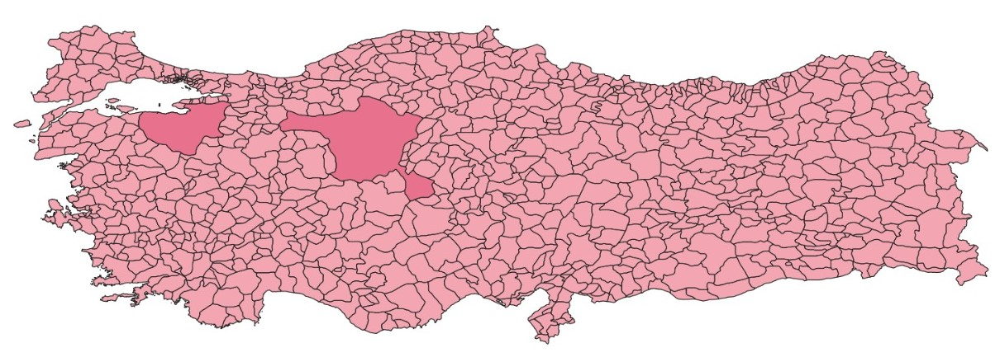
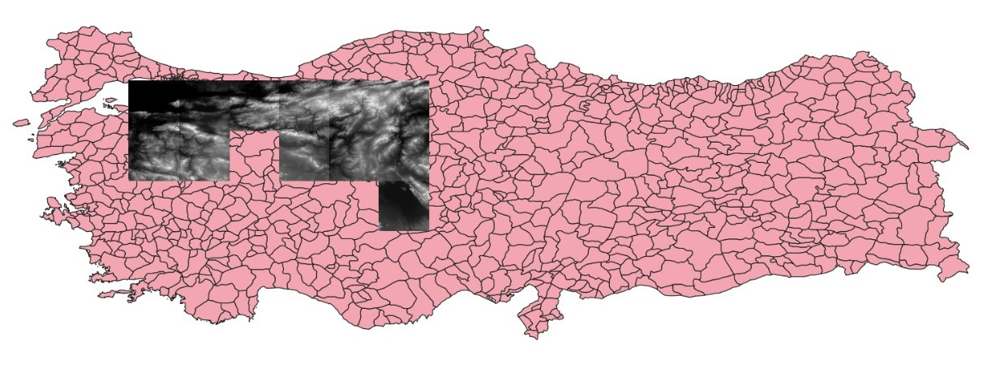
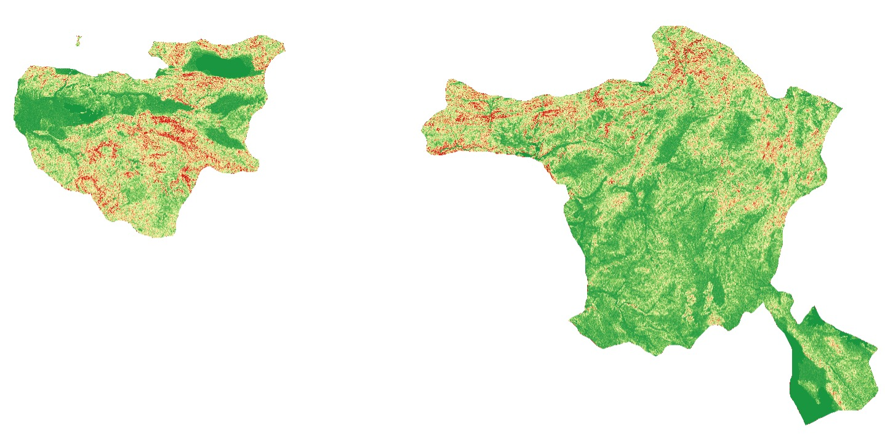
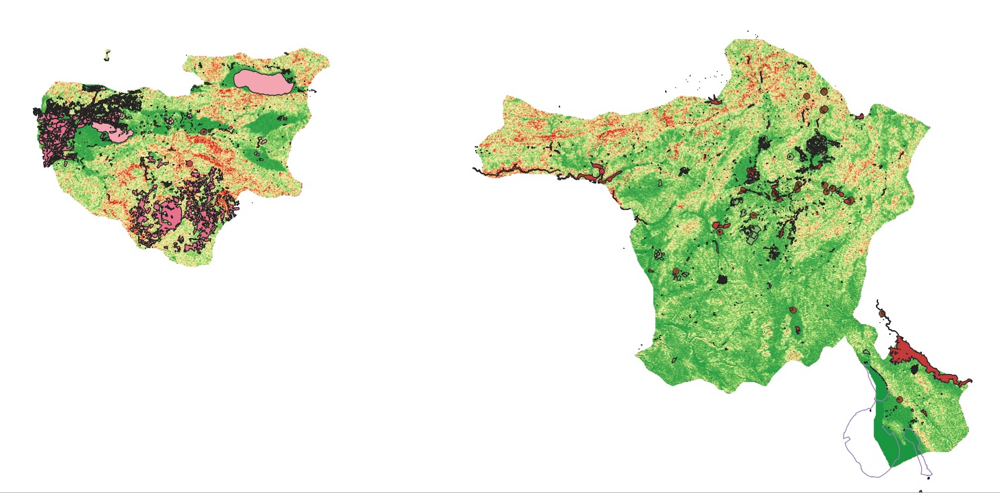
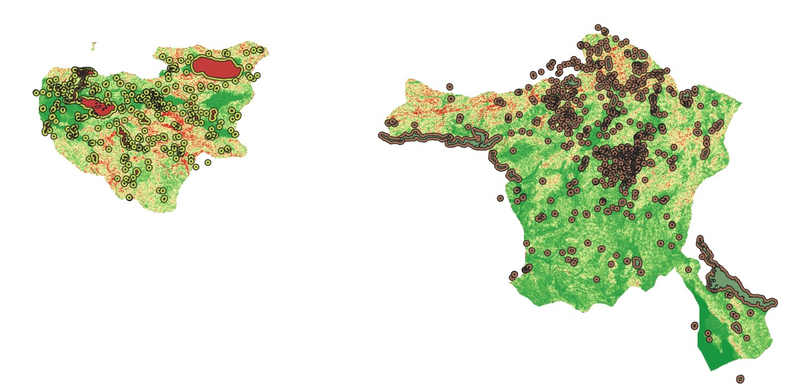

# Water Protection GIS 🌍

GIS-based water resource protection zone and pollution risk mapping project.  
In this project, DEM processing, slope analysis, buffer zone analysis, and risk classification were performed for Bursa and Ankara using QGIS.

---

## Technologies 🛠

- QGIS
- OpenStreetMap (QuickOSM)
- SRTM DEM
- Raster & Vector Analysis
- Buffer Analysis
- Intersection Analysis

---

# Workflow ⚙️

## 1. Study Area Selection 📍

Bursa and Ankara were selected as the study areas and administrative boundaries were filtered.

  

---

## 2. DEM Merge ⛰

SRTM DEM datasets were merged and clipped according to the study area boundaries.

  

---

## 3. Slope Analysis 📈

Slope maps were generated from DEM datasets.

  

---

## 4. Land Use Visualization 🌱

Industrial, agricultural, and water layers were created using OpenStreetMap data.

  

---

## 5. Buffer Zone Analysis 🟠

Protection buffer zones of 300m, 1000m, and 2000m were generated around water resources.

  

---

## Findings 🚨

- High-risk areas were identified around Bursa Organized Industrial Zone (BOSB).
- Protection zone violations were detected around Lake Iznik.
- Risk areas in Ankara showed a more scattered distribution.

---

## Data Sources 📂

- GADM
- USGS EarthExplorer
- OpenStreetMap
- QGIS
